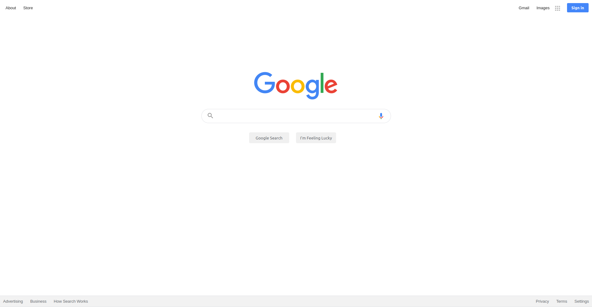

# The Odin Project - Google homepage solution

This is a solution to the [Google homepage assignment on the Odin Project](https://www.theodinproject.com/paths/foundations/courses/foundations/lessons/html-css#assignment). The Odin Project provides a free open source coding curriculum that can be taken entirely online.

### The assignment

- Build the Google.com homepage

### Screenshot

